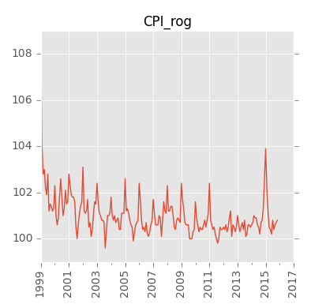
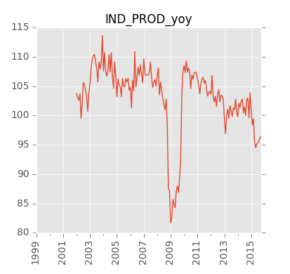
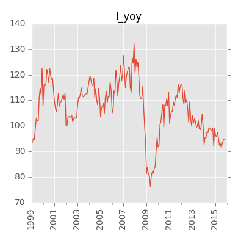
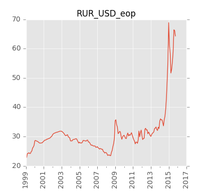
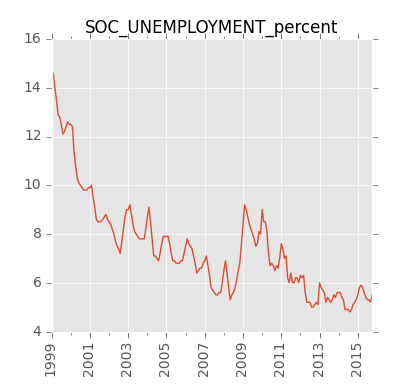
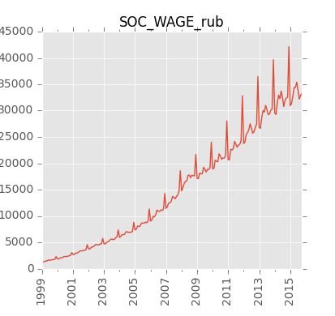

##Краткосрочные экономические показатели Российской Федерации  

Исходная публикация на сайте Росстата: [www.gks.ru][gks-stei] 

Ряды данных: 
- в формате Excel: [kep.xlsx][kep-at-git-xlsx], [kep.xls][kep-at-git-xls]
- в формате csv: 
  - [годовые](https://raw.githubusercontent.com/epogrebnyak/rosstat-kep-data/master/output/data_annual.txt) 
  - [квартальные](https://raw.githubusercontent.com/epogrebnyak/rosstat-kep-data/master/output/data_qtr.txt)
  - [месячные](https://raw.githubusercontent.com/epogrebnyak/rosstat-kep-data/master/output/data_monthly.txt) 

- [список переменных](https://raw.githubusercontent.com/epogrebnyak/rosstat-kep-data/master/output/varnames.md)

Графики:
- [PDF](https://github.com/epogrebnyak/rosstat-kep-data/blob/master/output/monthly.pdf)
- [*.png](https://github.com/epogrebnyak/rosstat-kep-data/blob/master/output/images.md)

[kep-at-git-xlsx]: https://github.com/epogrebnyak/rosstat-kep-data/blob/master/output/kep.xlsx?raw=true
[kep-at-git-xls]: https://github.com/epogrebnyak/rosstat-kep-data/blob/master/output/kep.xls?raw=true
[gks-stei]: http://www.gks.ru/wps/wcm/connect/rosstat_main/rosstat/ru/statistics/publications/catalog/doc_1140080765391


## Основные показатели




## Примеры работы с программой 

### Получение данных

```python
# query by variable name(s) 
z = kep.get_ts('SOC_WAGE_rub','a', 2014)
#assert isinstance(z, pd.core.series.Series)
#assert z.iloc[0] == 32495

e = get_df(['SOC_WAGE_rub', 'CPI_rog'], 'm', '2015-06', '2015-06')

# complete database:
annual_varnames = kep.get_varnames("a")
qtr_varnames    = kep.get_varnames("q")
month_varnames  = kep.get_varnames("m")
all_varnames    = kep.get_varnames(all = True)

dfa = get_df(annual_varnames)
dfq = get_df(qtr_varnames)
dfm = get_df(month_varnames)
```

### Импорт в базу данных

```python
import kep 
data_folder = "data/2015/ind10"
# TODO:
# must stop if (1) no Word installed, (2) CSV already exists 
kep.make_csv()
#
kep.import_csv()
# save data and variable list to Excel, CSV files, write plots to PDF and *.png 
kep.dump_db()
```


### Структура программы
```
PROGRAM FLOW

1. Converter
doc - > raw csv
(word.py)

2. Parser
raw csv + specification -> labelled csv -> flat stream -> database
        (specification.py) (label_csv.py)  (stream.py)    (database.py)

3. Selector
database -> dfm, dfq, dfa -> get_ts(), get_df()
                      ... -> get_varnames()   
(query.py)

4. Plotting
(plot.py)
```

##Todo

Самое важное сейчас:
- [ ] issue #31: Testing: make test_1.py executable with py.test
 
Экспорт данных
- [ ] issue  #1 - экспорт данных: улучшение форматирования xls(x) файлов / apearance of xlsx file

Парсинг и импорт 
- [ ] issue #34: make varlist, including segments
- [ ] make varlist in order of appearance in markupfile + include segments

Тестирование
- [ ] issue #31 - запустить py.test внутри пакета (вместе c __init__.py) - Testing: run test_1.py executable with py.test 

Текущие ошибки парсинга 
- [ ] #14: https://github.com/epogrebnyak/rosstat-kep-data/issues/14 'CORP_DEBT_rog' is invalid data (ind06)
- [ ] #35: не читается переменная 'PROFIT'

Рисунки:
- [ ] issue #33: Plotting: all single .png plots in plots.py lack proper dates on x axis

Докуменатция:
- [ ] issue #25: улучшить скрипт построения документации
- [ ] issue #32: написать примеры использвоания API - write API examples for README.md

##Done
Парсинг и импорт 
- [x] issue #30 - прочитать данные из csv c иcпользованием нескольких файлов разметки - read raw csv using config file and two spec files 

Экспорт данных
- [x] issue #24 - экспорт данных: xls файл
- [x] issue #26 - упрощение формата csv, use native pandas export for csv files

Рисунки:
- [x] issue #29: Save all monthly plots as .png files 
- [x] issue #27: make full list of .png files as markdown file 

##Not todo

Новые функции
- [ ] таблицы с нестандартным количеством столбцов, импорт данных по ВВП
- [ ] разбивка png-md или pdf файла на разделы
- [ ] новый шаблон pdf файла
- [ ] sql dump of database

Некритические
- [ ] transfer useful functions from old_src at src branch
- [ ] генерировать tab_headers.txt - использовать make_headers(p) в label_csv из ветки old_src
- [ ] issue #20: integrity check of database
- [ ] may remove first 'readers functions' part in spec file
- [ ] issue #6: orderly sequence of variables in xlsx file - in columns
- [ ] groups/sections of variables in pdf/md-png
- [ ] rename common to io + move load_spec to common + make test_load_spec.py
- [ ] check if header (eg "Объем платных услуг населению") has multiple appearances in raw csv file 
- [ ] issue #36: substitute 'tabulate' module with simple pure python function to write table
- [ ] maybe move 'output' folder to root  


##Итоговое использование
1. Ряды со снятием сезонности
2. Переменная состояния среды (фильтр Калмана по 3-5 переменным)
3. Индекс промышленного производства через натуральные показатели
4. Индекс инвестиций через инвестицонные товары 
5. Описание недостающих переменных и блоков (экспортные цены на нефть, например)
